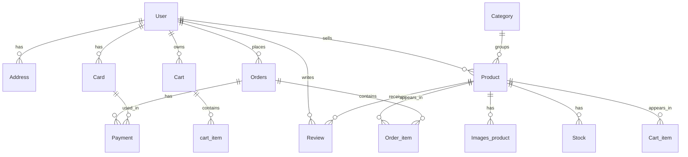

# E-Commerce API

API REST de e-commerce desenvolvida com Django e Django REST Framework para simular um fluxo completo de compra, desde o cadastro do usuário até pedido, pagamento e suporte.

## 1. Sobre o projeto

O objetivo deste projeto é disponibilizar uma API organizada, segura e fácil de consumir para um sistema de e-commerce. A aplicação cobre os principais fluxos de uma loja virtual:

- Cadastro, autenticação e atualização de usuários.
- Gestão de catálogo com categorias, produtos, imagens e variações de estoque.
- Carrinho de compras com cálculo automático de subtotal e total.
- Criação de pedidos a partir dos itens do carrinho.
- Registro de pagamentos com cartão, PIX e boleto.
- Avaliações de produtos por clientes.
- Contato com suporte por e-mail.

Perfis de acesso:

- `C` - Customer, usuário cliente.
- `L` - Shopkeeper, usuário lojista.
- Administrador - acesso de staff para gerenciamento geral.

## 2. Modelagem

A modelagem da API foi pensada para cobrir o fluxo principal de um e-commerce e suas relações mais importantes.



### Principais modelos

- `User` - usuário autenticado, com tipo de acesso, CPF, telefone e data de nascimento.
- `Address` - endereços salvos do cliente.
- `Card` - cartões salvos para pagamentos.
- `Category` - categorias de produtos.
- `Product` - produtos do catálogo.
- `Images_product` - imagens associadas ao produto.
- `Stock` - variações de cor, tamanho e quantidade.
- `Review` - avaliações e comentários de clientes.
- `Cart` e `cart_item` - carrinho e itens do carrinho.
- `Orders` e `Order_item` - pedidos e snapshot dos itens comprados.
- `Payment` - informações do pagamento vinculado ao pedido.
- `contact_support_email` - solicitações enviadas ao suporte.

## 3. Instalação e execução

### Pré-requisitos

- Python 3.8 ou superior.
- `pip`.
- Django 5.2.

### Passo a passo

```bash
# 1. Clone o repositório
git clone <repository-url>
cd API-Desafio-Back-end-EJECT

# 2. Crie e ative o ambiente virtual
python -m venv venv
source venv/bin/activate  # Linux/macOS
# venv\Scripts\activate   # Windows

# 3. Instale as dependências
pip install -r requirements.txt

# 4. Aplique as migrations
python manage.py migrate

# 5. Crie o superusuário
python manage.py createsuperuser

# 6. Inicie o servidor
python manage.py runserver
```

A API ficará disponível em `http://localhost:8000/`.

### Observação sobre e-mail

O projeto usa variáveis de ambiente para envio de e-mails em produção. Se quiser testar o fluxo de recuperação de senha e suporte localmente, configure as variáveis esperadas no arquivo de ambiente do projeto.

## 4. Dependências

Principais bibliotecas utilizadas e versões presentes em `requirements.txt`:

| Biblioteca | Versão | Uso |
| --- | --- | --- |
| Django | 5.2.14 | Framework principal |
| djangorestframework | 3.17.1 | Construção da API REST |
| djangorestframework_simplejwt | 5.5.1 | Autenticação JWT |
| drf-yasg | 1.21.15 | Swagger / ReDoc |
| django-filter | 25.2 | Filtros e ordenação |
| drf-nested-routers | 0.95.0 | Rotas aninhadas |
| pillow | 12.2.0 | Upload e manipulação de imagens |
| requests | 2.34.2 | Consulta externa ao CEP |
| validate-docbr | 2.0.0 | Validação de CPF |
| python-decouple | 3.8 | Variáveis de ambiente |
| django-cleanup | 9.0.0 | Limpeza de arquivos de mídia |
| django-colorfield | 0.14.0 | Campo de cor hexadecimal |

Dependências auxiliares relevantes:

- `PyJWT` - suporte ao JWT.
- `PyYAML`, `uritemplate`, `inflection`, `Markdown` - suporte ao Swagger.
- `sqlparse`, `asgiref` - dependências base do Django.

## 5. Documentação da API

A documentação interativa está disponível via Swagger e ReDoc.

### Acessos

- Swagger UI: `http://localhost:8000/swagger/`
- ReDoc: `http://localhost:8000/redoc/`
- Django Admin: `http://localhost:8000/admin/`

### O que você encontra no Swagger

- Descrição de cada endpoint.
- Payloads de exemplo para as requisições principais.
- Estrutura de campos esperados e respostas.
- Rotas agrupadas por contexto: autenticação, catálogo, carrinho, pedidos, pagamentos, reviews e suporte.

### Principais rotas

#### Autenticação
- `POST /api/auth/register/` - cadastro de usuário.
- `POST /api/auth/login/` - login com JWT.
- `POST /api/auth/login/refresh/` - renovação do token.
- `POST /api/auth/forgot-password/` - solicitação de redefinição de senha.
- `PATCH /api/auth/forgot-password/{encoded_pk}/{token}` - redefinição da senha.
- `GET /api/auth/user/update` - visualização do perfil autenticado.
- `PUT /api/auth/user/update` - atualização do perfil autenticado.
- `PATCH /api/auth/user/update` - atualização parcial do perfil.

#### Catálogo
- `GET /api/ecommerce/category/` - listagem de categorias.
- `POST /api/ecommerce/category/` - criação de categoria.
- `GET /api/ecommerce/product/` - listagem de produtos.
- `POST /api/ecommerce/product/` - criação de produto com imagens.
- `GET /api/ecommerce/product/{id}/` - detalhe de produto.
- `PUT /api/ecommerce/product/{id}/` - atualização de produto.
- `DELETE /api/ecommerce/product/{id}/` - remoção de produto.
- `GET /api/ecommerce/product/{product_pk}/variations/` - variações de estoque.
- `POST /api/ecommerce/product/{product_pk}/variations/` - criação de variação.
- `GET /api/ecommerce/product/{product_pk}/review/` - reviews do produto.
- `POST /api/ecommerce/product/{product_pk}/review/` - criação de review.

#### Carrinho
- `GET /api/ecommerce/cart/` - carrinho do usuário autenticado.
- `POST /api/ecommerce/cart/items/` - adicionar item ao carrinho.
- `PUT /api/ecommerce/cart/items/{id}/` - atualizar item do carrinho.
- `DELETE /api/ecommerce/cart/items/{id}/` - remover item do carrinho.

#### Pedidos e pagamentos
- `GET /api/ecommerce/order/` - listagem de pedidos.
- `POST /api/ecommerce/order/` - criação de pedido a partir do carrinho.
- `PATCH /api/ecommerce/order/{id}/cancel/` - cancelamento de pedido pendente.
- `GET /api/ecommerce/order/{order_pk}/payment/` - listagem de pagamentos do pedido.
- `POST /api/ecommerce/order/{order_pk}/payment/` - criação de pagamento.

#### Suporte
- `POST /api/ecommerce/contact/email/` - envio de mensagem ao suporte.

### Exemplos rápidos de payload

Cadastro de usuário:

```json
{
  "fullname": "Maria Souza",
  "cpf": "12345678909",
  "email": "maria@example.com",
  "password": "StrongPass#123",
  "password_confirm": "StrongPass#123",
  "phone": "(84) 9 9999-9999",
  "date_of_birth": "2000-01-01",
  "usertype": "C"
}
```

Criação de produto:

```json
{
  "title": "Camisa Oversized",
  "content": "Camisa de algodão com caimento amplo.",
  "price": "79.90",
  "category": 1,
  "active": true,
  "upload_images": ["<file1>", "<file2>"]
}
```

Criação de pedido:

```json
{
  "cart_item_ids": [1, 2, 3]
}
```

Criação de pagamento com cartão:

```json
{
  "type": "credit_card",
  "card_id": 1
}
```

Criação de pagamento via PIX:

```json
{
  "type": "pix"
}
```

## Autenticação

Para consumir as rotas protegidas, envie o token no cabeçalho:

```bash
Authorization: Bearer <seu_token>
```

## Testes

A documentação já pode ser validada manualmente pelo Swagger, mas também é possível consumir a API com cURL ou Postman usando os exemplos de payload acima.

## Licença

Este projeto é fornecido para fins educacionais e comerciais conforme o contexto do repositório.

---

**Stack principal:** Django 5.2, Django REST Framework, Simple JWT e drf-yasg.

## 6. Observações sobre evolução da API

A implementação ainda está em construção em alguns pontos do fluxo de pedidos e pagamentos.

- Melhorar o endpoint de `orders` e `payment` para deixar as respostas mais completas e consistentes.
- Implementar a gestão de pedidos para o lojista, permitindo acompanhar e administrar os pedidos recebidos.
- Ajustar a documentação do Swagger conforme essas evoluções forem sendo concluídas.
